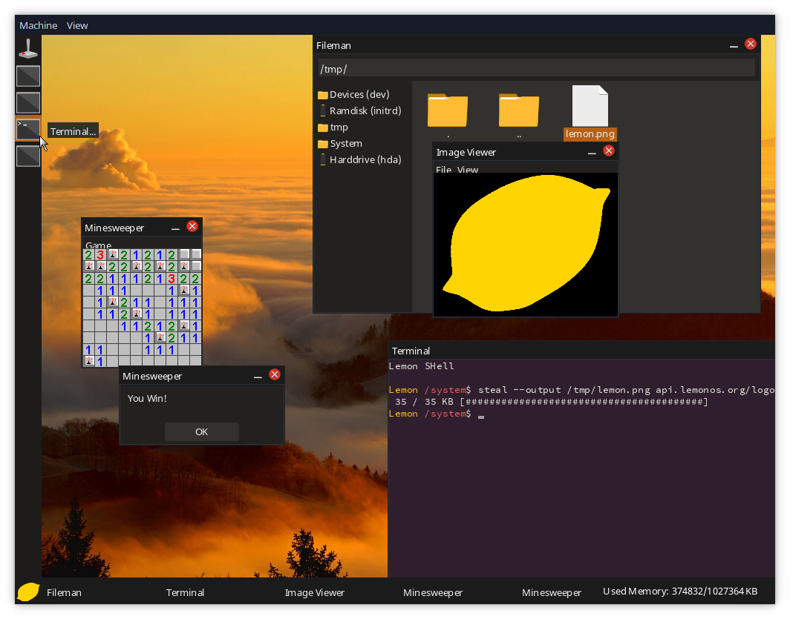

Lemon OS is a UNIX-like 64-bit operating system written in C++.

## About Lemon OS
Lemon OS includes its own [modular kernel](Kernel) with SMP and networking, [window server/compositor](System/LemonWM) and [userspace applications](Applications) as well as [a collection of software ports](Ports).

If you have any questions or concerns feel free to open a GitHub issue, join our [Discord server](https://discord.gg/NAYp6AUYWM) or email me at computerfido@gmail.com.

[Website](https://lemonos.org) \
[Discord Server](https://discord.gg/NAYp6AUYWM)

## Building
- [Building Lemon OS](Documentation/Build/Building-Lemon-OS.md)
- [Building Lemon OS with Docker (Outdated)](Documentation/Build/Building-Lemon-OS-with-Docker.md)

## Prebuilt Image
[Nightly Images](https://github.com/LemonOSProject/LemonOS/actions/workflows/ci.yml?query=is%3Asuccess+branch%3Amaster) - Go to latest job, `Lemon.img` located under Artifacts\
[Latest Release](https://github.com/LemonOSProject/LemonOS/releases/latest)

\
[More screenshots](Screenshots)
## Features
- Modular Kernel
- Symmetric Multiprocessing (SMP)
- UNIX/BSD Sockets (local/UNIX domain and internet)
- Network Stack (UDP, TCP, DHCP)
- A small HTTP client/downloader called [steal](Applications/Steal)
- Window Manager/Server [LemonWM](System/LemonWM)
- [Terminal Emulator](Applications/Terminal)
- Writable Ext2 Filesystem
- IDE, AHCI and NVMe Driver
- Dynamic Linking
- Ports including LLVM/Clang, Ninja, Freetype, Binutils and Python 3.8
- [mlibc](https://github.com/managarm/mlibc) C Library Port
- [GnuBoy Port](https://github.com/LemonOSProject/lemon-gnuboy)
- [DOOM Port](https://github.com/LemonOSProject/LemonDOOM)

## Work In Progress
- XHCI Driver
- Intel HD Audio Driver

## System requirements
- 256 MB RAM (512 is more optimal)
- x86_64 Processor
- 2 or more CPU cores recommended
- I/O APIC
- ATA, NVMe or AHCI disk (AHCI *strongly* recommended)

## Repo Structure

| Directory     | Description                        |
| ------------- | ---------------------------------- |
| Applications/ | Userspace Applications             |
| Base/         | Config, etc. Files copied to disk  |
| Documentation/| Lemon OS Documentation             |
| Extra/        | (Currently) vector icons           |
| Kernel/       | Lemon Kernel                       |
| LibLemon/     | LibLemon (Lemon API)               |
| Toolchain/    | Toolchain build scripts and patches|
| Ports/        | Build scripts and patches for ports|
| Resources/    | Images, fonts, etc.                |
| Scripts/      | Build Scripts                      |
| Screenshots/  | Screenshots                        |
| System/       | Core system programs and services  |
