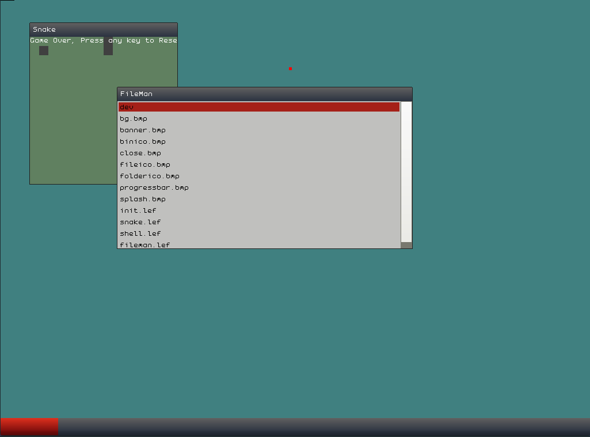

#Lemon-OS#

The Lemon Operating System

System requirements:
- 64 MB RAM
- SSE2 Compatible x86/x86_64 Processor
- VESA VBE support
- Recommended Resolution of at least 800x600, preferably around 1024x768 and up

Features
- Task scheduling
- ELF program loading
- C and C++ Library
- Window Manager
- Snake
- Gnuboy Gameboy Colour Emulator Port (Separate)

Build Requirements:
- UNIX-like system (e.g. Linux or Windows under WSL)
- GNU binutils, make and GCC
