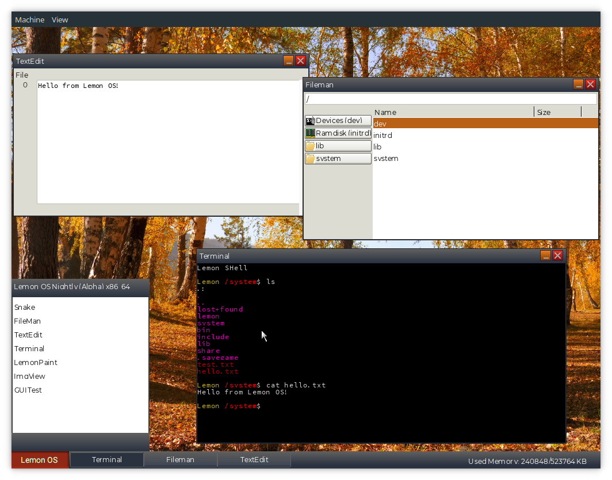
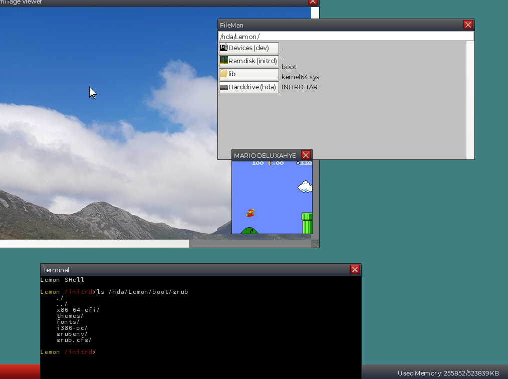
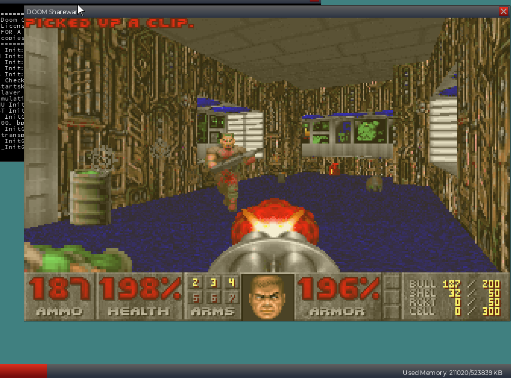

# Lemon OS

The Lemon Operating System

Lemon OS is a UNIX-like 64-bit operating system written in C++.

(https://lemonos.org)

### Prebuilt Image
[Latest Prebuilt Image](https://github.com/fido2020/Lemon-OS/releases/tag/0.2.2)

### Building
See [Building Lemon OS](https://github.com/fido2020/Lemon-OS/wiki/Building-Lemon-OS)

### Features
- Symmetric Multiprocessing (SMP)
- UNIX Domain Sockets
- Window Manager/Server (LemonWM)
- Graphical Shell
- Terminal Emulator
- Writable Ext2 Filesystem
- IDE and AHCI Driver
- Dynamic Linking
- Intel 8254x Ethernet Driver
- Ports including Freetype, Binutils and Python 3.8
- [mlibc](https://github.com/managarm/mlibc) C Library Port
- [GnuBoy Port](https://github.com/fido2020/lemon-gnuboy)
- [DOOM Port](https://github.com/fido2020/LemonDOOM)

### Work In Progess
- Network Stack

### System requirements
- 256 MB RAM (512 is more optimal)
- x86_64 Processor
- 2 cores/CPUs recommended
- I/O APIC

## Repo Structure

| Directory     | Description                        |
| ------------- | ---------------------------------- |
| Applications/ | Userspace Applications             |
| Base/         | Files copied to disk               |
| Kernel/       | Lemon Kernel                       |
| LibLemon/     | LibLemon (Lemon API)               |
| Toolchain/    | Cross Compiler Patches             |
| Ports/        | Build scripts and patches for ports|
| Resources/    | Images, fonts, etc.                |
| Scripts/      | Build Scripts                      |
| Screenshots/  | Screenshots                        |
| System/       | Core system programs and services  |

